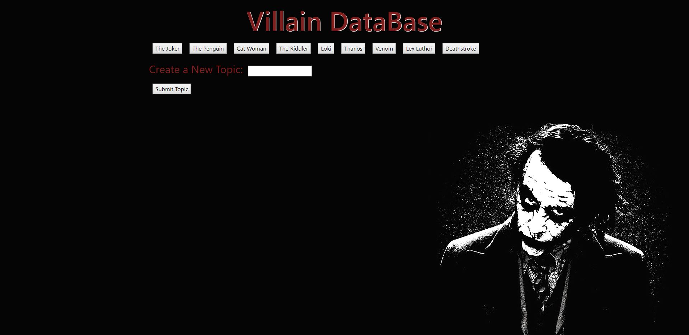

# GifTastic

GifTastic is a Giphy based API call that returns 10 GIFs based on the button clicked by the user. It also returns a rating from Giphy for the GIF (G, PG, PG-13). The user also has the ability to create their own button and have it added to the list of searchable GIFs. 
As a whole it is a very simple app that allowed me to learn and experiment with API calls and JSON.

View the site here: https://cjochen2.github.io/GifTastic/

Note: There is an issue on the serve side with some of these calls. Depending on the time a call may or may not work depending on which server it uses. One day "The Joker" will work as intended and the next it will return an authorization error. The working theory is that Giphy's servers have different protocols and some will accept calls from my domain while others will not recognize it.
